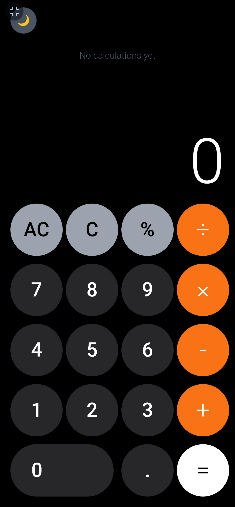
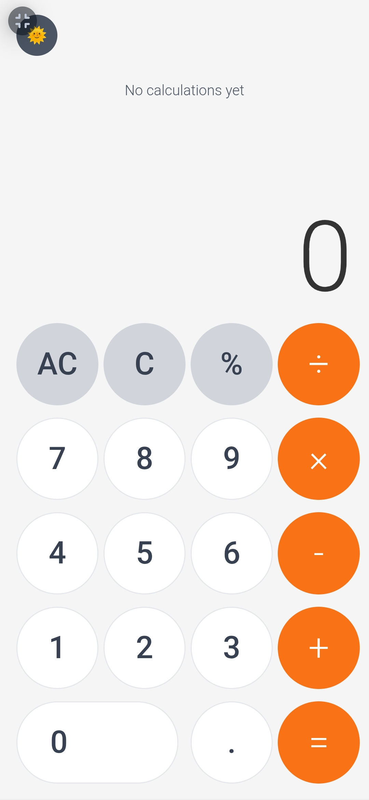

# Calculator

A modern, responsive calculator built with HTML, CSS, and JavaScript.

## Features
- ✨ Dark/Light theme toggle
- 📱 Responsive design
- 📊 Calculation history
- ⌨️ Keyboard support
- 🎯 Input validation (prevents invalid operations)

## Demo
[Live Demo](https://derrickappah.github.io/Calculator/)

## Screenshots

### Dark Mode


### Light Mode  



## Technologies Used
- HTML5
- CSS3 (Tailwind CSS)
- Vanilla JavaScript

## How to Use
1. Click numbers and operators to build expressions
2. Press = or Enter to calculate
3. Use AC to clear all, C to clear entry
4. Click the moon/sun icon to toggle themes
5. Click on history items to reuse previous results

## Installation
1. Clone this repository
2. Open `index.html` in your browser
```
